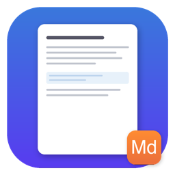

<p align="center">
  
</p>

<h1 align="center">MarkView</h1>

<p align="center">
  Lightweight open-source Markdown viewer for macOS with Quick Look support.
  <br>
  Built with SwiftUI + WKWebView. No Electron. ~250KB binary.
</p>

<p align="center">
  <a href="LICENSE">MIT License</a>
</p>

---

## Features

- **Full app** — open any `.md` file with GitHub-style rendering (tables, code blocks, task lists, blockquotes)
- **Quick Look** — press Space on `.md` files in Finder for instant preview
- **Dark mode** — automatic, follows system appearance
- **Native macOS** — SwiftUI + WKWebView, not Electron
- **Tiny** — ~250KB binary, instant launch
- **GFM support** — GitHub Flavored Markdown via [marked.js](https://github.com/markedjs/marked) (app) and built-in Swift parser (Quick Look)
- **Open With** — registers as `.md` file viewer, available in right-click menu

## Install

### Build from source

Requires macOS 14+ and Xcode Command Line Tools.

```bash
git clone https://github.com/jlutou/MarkView.git
cd MarkView
./build.sh
cp -r build/MarkView.app /Applications/
```

### Download

Grab the latest `MarkView.app.zip` from [Releases](https://github.com/jlutou/MarkView/releases).

After placing in `/Applications/`, launch once to register the Quick Look extension. Then enable it in **System Settings → General → Login Items & Extensions → Extensions → Quick Look**.

## How it works

| Component | Renderer | Why |
|-----------|----------|-----|
| Full app | WKWebView + [marked.js](https://github.com/markedjs/marked) | Full GFM, JS-powered, pixel-perfect |
| Quick Look | WKWebView + Swift parser | No JS dependencies, works in sandbox |

The app bundles a Quick Look Preview Extension (`.appex`) that activates automatically when installed.

## Project structure

```
MarkView/
├── Sources/
│   ├── MarkViewApp.swift          # SwiftUI app entry point
│   ├── MarkdownDocument.swift     # FileDocument for .md files
│   ├── ContentView.swift          # WKWebView wrapper
│   ├── MarkdownRenderer.swift     # HTML renderer (marked.js)
│   ├── MarkdownParser.swift       # Pure Swift markdown-to-HTML
│   ├── PreviewViewController.swift # Quick Look extension
│   └── marked.min.js              # Markdown parser (MIT)
├── Info.plist                     # App manifest
├── QLExtension-Info.plist         # Quick Look extension manifest
├── QLExtension.entitlements       # Sandbox entitlements
├── MarkView.icns                  # App icon
├── make_icon.py                   # Icon generator script
└── build.sh                       # Build script (no Xcode needed)
```

## Requirements

- macOS 14 (Sonoma) or later
- Apple Silicon (arm64)

## License

[MIT](LICENSE) — free for any use.

Third-party: [marked.js](https://github.com/markedjs/marked) (MIT).
